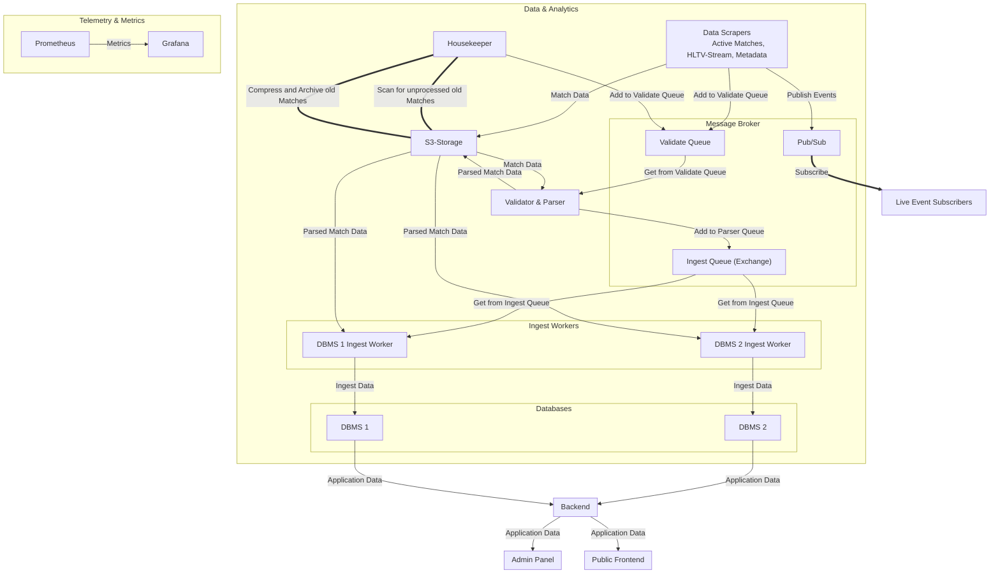

# Software Architecture

This chart is a high-level overview of the software architecture of the project.

_It is a work in progress and will be updated as the project progresses._

```mermaid
flowchart TB
    subgraph D["Data & Analytics"]
        S["S3-Storage"]
        
        DS["
            Data Scrapers
            Active Matches, HLTV-Stream, Metadata
        "]
        DS -- Match Data --> S
        DS -- Add to Validate Queue --> MBV
        DS -- Publish Events --> MBPS
        
        H["Housekeeper"]
        H == Scan for unprocessed old Matches === S
        H == Compress and Archive old Matches === S
        H -- Add to Validate Queue --> MBV
        
        subgraph MB["Message Broker"]
            MBV["Validate Queue"]
            MBI["Ingest Queue (Exchange)"]
            MBPS["Pub/Sub"]
        end
        
        V["Validator & Parser"]
        MBV -- Get from Validate Queue --> V
        S -- Match Data --> V
        V -- Parsed Match Data --> S
        V -- Add to Parser Queue --> MBI
        
        subgraph ingest["Ingest Workers"]
            IP["DBMS 1 Ingest Worker"]
            IC["DBMS 2 Ingest Worker"]
        end
        
        subgraph databases["Databases"]
            DBP["DBMS 1"]
            DBC["DBMS 2"]
        end
        
        MBI -- Get from Ingest Queue --> IC
        MBI -- Get from Ingest Queue --> IP
        S -- Parsed Match Data --> IP
        S -- Parsed Match Data --> IC
        IC -- Ingest Data --> DBC
        IP -- Ingest Data --> DBP
    end
    
    subgraph T["Telemetry & Metrics"]
        %% Not designed yet
        P["Prometheus"]
        G["Grafana"]
        P -- Metrics --> G
    end
    
    subgraph B["Backend"]
    %% Not designed yet
    end
    DBC -- Application Data --> B
    DBP -- Application Data --> B

    subgraph AP["Admin Panel"]
    %% Not designed yet
    end
    B -- Application Data --> AP
    
    subgraph F["Public Frontend"]
    %% Not designed yet
    end
    B -- Application Data --> F

    SU["Live Event Subscribers"]
    MBPS == Subscribe ==>SU
```
